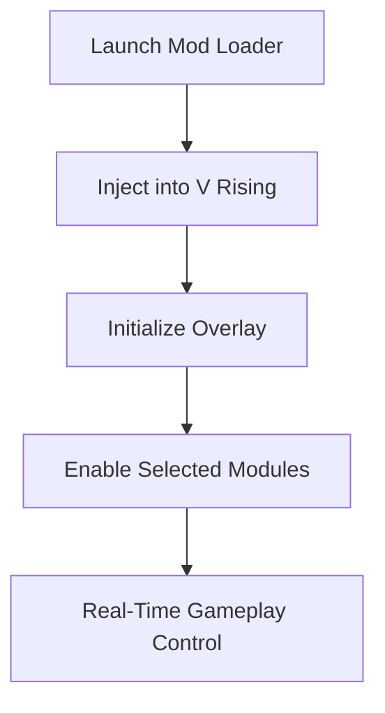

# V Rising Mod Menu

The night in **V Rising** is never silent. It whispers with danger, opportunity, and hunger. The **V Rising Mod Menu** is not just an add-on—it is a control layer, a piece of software that lets you *listen* to those whispers and act before the world does.

Built for players who want awareness, customization, and technical clarity, this mod menu reshapes how you interact with Vardoran. Every setting is a lever. Every toggle, a shadow you can bend.

---

## Overview

The V Rising Mod Menu is a Windows-based modification tool designed to inject real-time gameplay enhancements into the V Rising client. It focuses on **visibility, control, and efficiency**, without bloated interfaces or unnecessary complexity.

Instead of overwhelming you, the menu flows—minimal panels, clean hotkeys, and modular features you can enable or disable at will. Whether you’re farming resources under moonlight or navigating PvP-heavy servers, the tool adapts to your pace.

This is software for players who prefer *knowing* over guessing.

---

## ✨ Core Features

Each feature is designed as an independent module, allowing full personalization.

### 👁 Visual Awareness (ESP Layer)

* Enemy highlights (NPCs & bosses)
* Player outlines with distance indicators
* Loot visibility with rarity-based colors
* Resource nodes marked through terrain

The world becomes legible, like a map written in moon-ink.

### 🎯 Combat & Survival Tweaks

* Adjustable cooldown control
* Stamina and health monitoring overlays
* Damage feedback indicators
* Optional no-clip (private/offline use)

### 🧭 Exploration & Farming Tools

* Teleport points (config-based)
* Fast travel unlock toggles
* Day/night cycle indicators
* Auto-loot radius adjustment 💧

### ⚙️ Menu & UX

* In-game overlay (Insert key by default)
* Custom hotkey binding
* Profile-based configs (PvE / PvP / Farming)
* Lightweight injection, low performance footprint

---

## ⚡ Setup & Installation

Installation is designed to be quiet and fast—like slipping into mist.

1. Close V Rising completely
2. Launch the Mod Menu loader as Administrator
3. Start V Rising from Steam
4. Press **Insert** in-game to open the menu
5. Load or create a config profile

Example config snippet:

```ini
[ESP]
Players=true
Bosses=true
LootRarity=Epic+

[Controls]
MenuKey=Insert
TeleportKey=F6
```

> [!IMPORTANT]
> Always match the mod menu build with the current V Rising patch to ensure stability.

---

## 🔁 How It Works (Flow Diagram)



The process is linear, predictable, and reversible—no permanent changes to game files.

---

## ❓ FAQ

**Is this mod menu safe to use?**
Designed primarily for PvE and private servers. Public PvP servers may have anti-cheat risks.

**Can I customize visuals only?**
Yes. All combat and movement modules can be disabled independently.

**Does it affect FPS?**
Minimal impact. ESP rendering is optimized and capped.

**Are updates frequent?**
Yes. Builds are typically updated within 24–48 hours after major patches.

**Can I share configs with friends?**
Config files are portable and easy to import.

---

## Final Thoughts 🌑

Power in V Rising has always been about timing—knowing when to strike, when to hide, when to feed. The **V Rising Mod Menu** does not play the game for you. It simply lifts the veil.

With clearer vision, tighter control, and a UI that respects your rhythm, you remain the vampire behind the throne.

The night is wide.
Now you can see it.
